[toc]

### 概述

- Zookeeper 是一个开源的分布式的，为分布式应用提供**协调服务**的 Apache 项目。

- **Zookeeper = 文件系统 + 通知机制**

  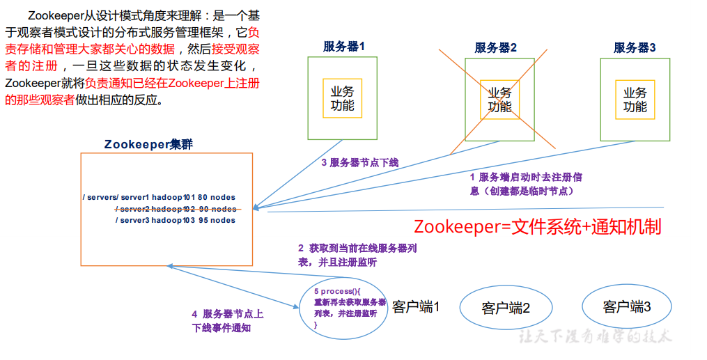
  
  - 客户端在zk上注册监听，服务端上下线都会通知到zk

### 特点

​	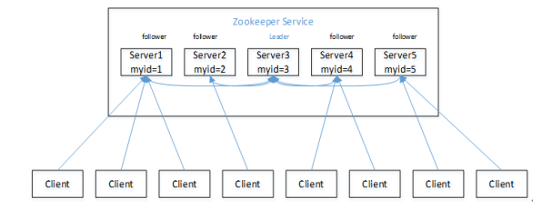

- Zookeeper：一个领导者（Leader），多个跟随者（Follower）组成的集群。
- 集群中只要有半数以上节点存活，Zookeeper集群就能正常服务。
- 全局数据一致：**每个Server保存一份相同的数据副本**，Client无论连接到哪个Server，数据都是一致的。
- 更新请求顺序进行，来自同一个Client的更新请求按其发送顺序依次执行。
- 数据更新原子性，一次数据更新要么成功，要么失败。
- 实时性，在一定时间范围内，Client能读到最新数据。

### 数据结构

- ZooKeeper数据模型的结构与Unix文件系统很类似，整体上可以看作是一棵树，每个节点称做一 个ZNode。每一个ZNode默认能够存储1MB的数据，每个ZNode都可以通过其路径唯一标识。

  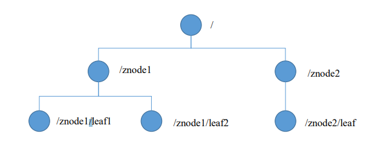

### 应用场景

#### 统一命名服务

​	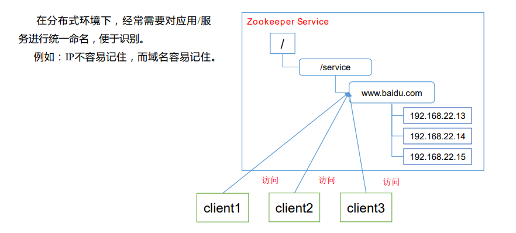

#### 统一配置管理

​	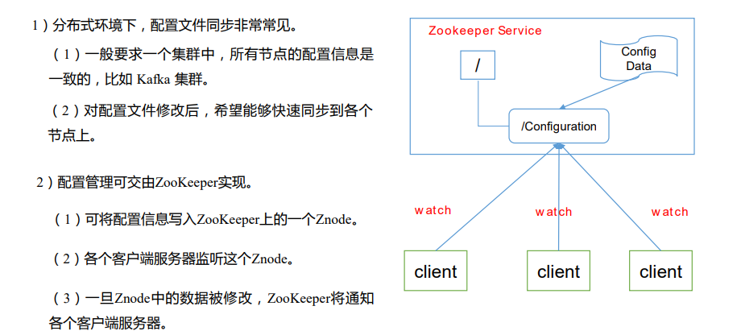

#### 统一集群管理

​	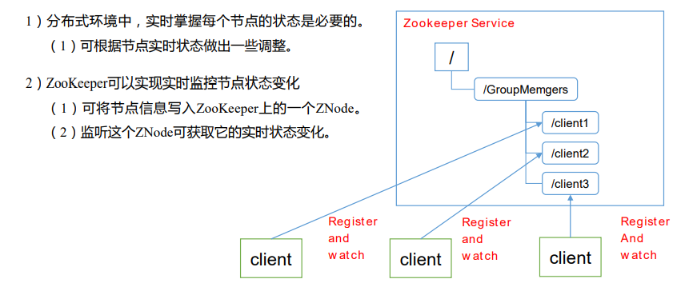

#### 服务器节点动态上下线

​	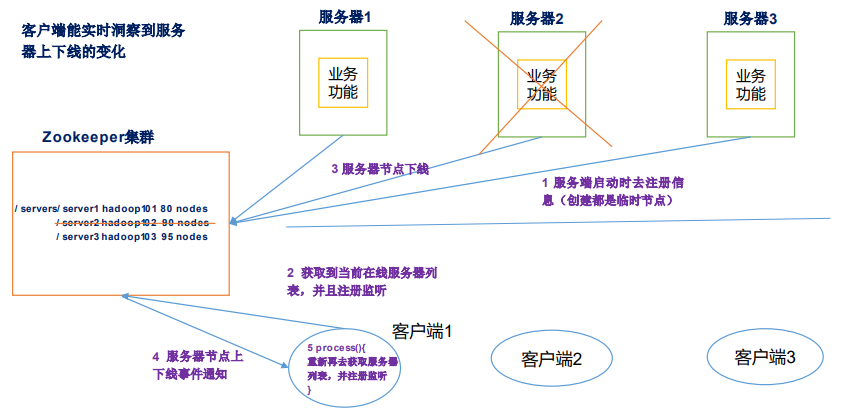

#### 软负载均衡

- 在Zookeeper中记录每台服务器的访问数，让访问数最少的服务器去处理最新的客户端请求

​	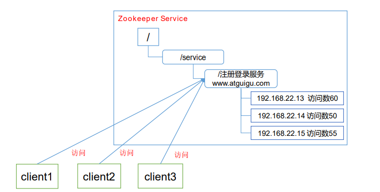

### 下载安装

​	[官网](https://zookeeper.apache.org/)

1. 安装jdk

2. 下载解压zookeeper，备份zoo_sample.cfg，并拷贝一份为zoo.cfg，配置如下：

   ```properties
   # 单位ms，通信心跳数，Zookeeper服务器与客户端心跳时间
   tickTime=2000
   
   # 集群中的follower服务器(F)与leader服务器(L)之间初始连接时能容忍的最多心跳数（tickTime的数量）
   initLimit=10
   
   # 集群中的follower服务器与leader服务器之间请求和应答之间能容忍的最多心跳数（tickTime的数量）
   syncLimit=5
   
   # Zookeeper保存数据的目录，默认情况下，Zookeeper将写数据的日志文件也保存在这个目录里。
   dataDir=/tmp/zookeeper
   
   # 客户端连接 Zookeeper 服务器的端口，Zookeeper 会监听这个端口，接受客户端的访问请求。
   clientPort=2181
   
   # the maximum number of client connections.
   # increase this if you need to handle more clients
   maxClientCnxns=60
   
   # Be sure to read the maintenance section of the 
   # administrator guide before turning on autopurge.
   # http://zookeeper.apache.org/doc/current/zookeeperAdmin.html#sc_maintenance
   
   # 客户端在与zookeeper交互过程中会产生非常多的日志，而且zookeeper也会将内存中的数据作为snapshot
   # 保存下来，这些数据是不会被自动删除的，这样磁盘中这样的数据就会越来越多。不过可以通过这两个参数来设置，
   # 让zookeeper自动删除数据。
   autopurge.snapRetainCount=3
   autopurge.purgeInterval=1
   
   ## Metrics Providers
   #
   # https://prometheus.io Metrics Exporter
   #metricsProvider.className=org.apache.zookeeper.metrics.prometheus.PrometheusMetricsProvider
   #metricsProvider.httpPort=7000
   #metricsProvider.exportJvmInfo=true
   ```


### 内部原理

#### 选举机制

- 半数机制：集群中半数以上机器存活，集群可用。所以 Zookeeper 适合安装奇数台服务器。
- Zookeeper 虽然在配置文件中并没有指定Master和Slave。但是，Zookeeper工作时，是有一个节点为 Leader，其他则为 Follower，Leader是通过内部的选举机制临时产生的。

- 以一个简单的例子来说明整个选举的过程。

  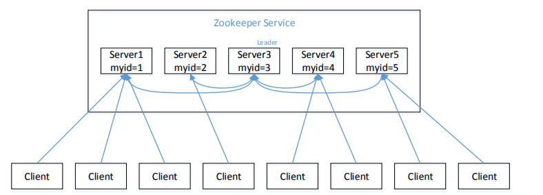

  

  1. 服务器 1 启动，发起一次选举。服务器 1 投自己一票。此时服务器 1 票数一票， 不够半数以上（3 票），选举无法完成，服务器 1 状态保持为 LOOKING；
  2. 服务器 2 启动，再发起一次选举。服务器 1 和 2 分别投自己一票并交换选票信息： 此时服务器 1 发现服务器 2 的 ID 比自己目前投票推举的（服务器 1）大，更改选票为推举 服务器 2(**编号越大在选择算法中的权重越大**)。此时服务器 1 票数 0 票，服务器 2 票数 2 票，没有半数以上结果，选举无法完成， 服务器 1，2 状态保持 LOOKING
  3. 服务器 3 启动，发起一次选举。此时服务器 1 和 2 都会更改选票为服务器 3。此 次投票结果：服务器 1 为 0 票，服务器 2 为 0 票，服务器 3 为 3 票。此时服务器 3 的票数已 经超过半数，服务器 3 当选 Leader。服务器 1，2 更改状态为 FOLLOWING，服务器 3 更改 状态为 LEADING；
  4. 服务器 4 启动，发起一次选举。此时服务器 1，2，3 已经不是 LOOKING 状态， 不会更改选票信息。交换选票信息结果：服务器 3 为 3 票，服务器 4 为 1 票。此时服务器 4 服从多数，更改选票信息为服务器 3，并更改状态为 FOLLOWING；
  5. 服务器 5 启动，同 4 一样当小弟。

#### 节点类型

- 持久型（Persistent）：客户端和服务器端断开连接后，创建的节点不删除

- 短暂型（Ephemeral）：客户端和服务器端断开连接后，创建的节点自己删除

  - 持久化目录节点：客户端与Zookeeper断开连接后，该节点依旧存在
  - 持久化顺序编号目录节点：客户端与Zookeeper断开连接后，该节点依旧存 在，只是Zookeeper给该节点名称进行顺序编号
  - 临时目录节点：客户端与Zookeeper断开连接后，该节点被删除
  - 临时顺序编号目录节点：客户端 与 Zookeeper 断开连接后 ， 该 节 点 被 删 除 ， 只 是 Zookeeper给该节点名称进行顺序编号。

  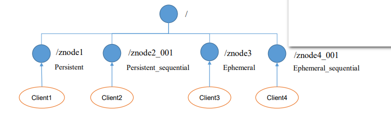

- 创建znode时设置顺序标识，znode名称 后会附加一个值，顺序号是一个单调递增的计数 器，由父节点维护
- 在分布式系统中，顺序号可以被用于为所有的事件进行全局排序，这样客户端可以通过顺序号推断事件的顺序

#### Stat结构体

- ZooKeeper命名空间中的每个znode都有一个与之关联的stat结构，类似于Unix/Linux文件系统中文件的stat结构。

- 在ZooKeeper Java shell中，可以使用`stat`或`ls2`命令查看znode的stat结构

  ```shell
  [zk: localhost:2181(CONNECTED) 1] stat /
  cZxid = 0x0
  ctime = Thu Jan 01 08:00:00 CST 1970
  mZxid = 0x0
  mtime = Thu Jan 01 08:00:00 CST 1970
  pZxid = 0x300000002
  cversion = 0
  dataVersion = 0
  aclVersion = 0
  ephemeralOwner = 0x0
  dataLength = 0
  numChildren = 2
  ```

-  znode的stat结构中的字段显示如下，各自的含义如下：

  1. `cZxid`：创建znode节点的事务id，每次修改 ZooKeeper 状态都会收到一个cZxid形式的时间戳，也就是 ZooKeeper事务ID。事务ID是ZooKeeper中所有修改总的次序。每个修改都有唯一的 cZxid，如果cZxid1 小于cZxid2，那么cZxid1 在cZxid2 之前发生。
  2. `ctime`：znode被创建的毫秒数(从 1970 年开始)
  3. `mzxid`：znode最后更新的事务 zxid
  4. `mtime`：znode 最后修改的毫秒数(从 1970 年开始)
  5. `pZxid`：znode 最后更新的子节点 zxid
  6. `cversion`：znode 子节点变化号，znode 子节点修改次数
  7. `dataversion`：znode 数据变化号，表示对该znode的数据所做的更改次数。
  8. `aclVersion`：znode的acl的变化号，表示对此znode的ACL进行更改的次数。
  9. `ephemeralOwner`：如果是临时节点，这个是 znode 拥有者的 session id。如果不是临时节点则是 0。
  10. `dataLength`：znode 的数据长度
  11. `numChildren`：znode 子节点数量

#### 监听器原理

- 监听原理详解：

  1. 首先要有一个`main()`线程
  2. 在`main`线程中创建Zookeeper客户端，这时就会创建两个线程，一个负责网络连接通信（connet），一个负责监听（listener）。
  3. 通过connect线程将注册的监听事件发送给Zookeeper。
  4. 在Zookeeper的注册监听器列表中将注册的监听事件添加到列表中。
  5. Zookeeper监听到有数据或路径变化，就会将这个消息发送给listener线程。
  6. listener线程内部调用了process()方法。

  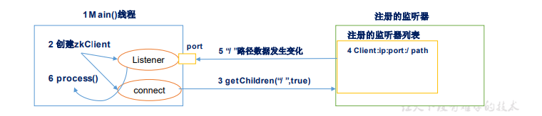

- 常见的监听
  1. 监听节点数据的变化：`get path [watch]`
  2. 监听子节点增减的变化：`ls path [watch]`

### ZAB协议

- ZAB（Zookeeper Atomic Broadcast） 协议是为分布式协调服务zookeeper专门设计的一种支持崩溃恢复的原子广播协议。在zookeeper中，主要依赖ZAB协议来实现分布式数据一致性，基于该协议，zookeeper实现了一种主备模式的系统架构来保持集群中各个副本之间的数据一致性。
- ZAB协议包含两种基本模式，分别是：
  - 崩溃恢复之数据恢复
  - 消息广播之原子广播
- 当整个集群正在启动时，或者当leader节点出现网络中断、崩溃等情况时，ZAB协议就会进入恢复模式并选举产生新的leader，当leader服务器选举出来后，并且集群中有过半的机器和该leader节点完成数据同步后（同步指的是数据同步，用来保证集群中过半的机器能够和leader服务器的数据状态保持一致），ZAB协议就会退出恢复模式。
- 当集群中已经有过半的Follower节点完成了和Leader状态同步以后，那么整个集群就进入了消息广播模式。这个时候，在Leader节点正常工作时，启动一台新的服务器加入到集群，那这个服务器会直接进入数据恢复模式，和leader节点进行数据同步。同步完成后即可正常对外提供非事务请求的处理。

#### 消息广播(原子广播)

- 消息广播实际上是一个简化版的2PC提交过程。

  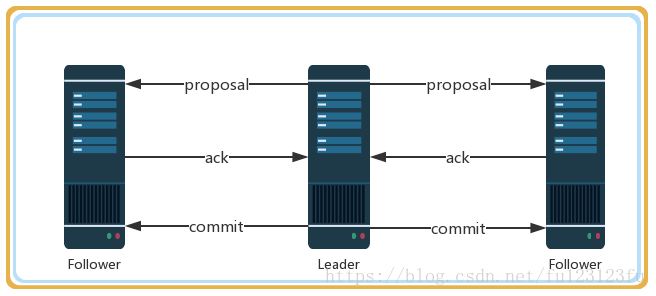

- 过程
  1. leader接收到消息请求后，将消息赋予一个全局唯一的64位自增id，叫：zxid，通过zxid的大小比较就可以实现因果有序这个特征。
  2. leader为每个follower准备了一个FIFO队列（通过TCP协议来实现，以实现全局有序这一个特点）将带有zxid的消息作为一个提案（proposal）分发给所有的 follower。
  3. 当follower接收到proposal，先把proposal写到磁盘，写入成功以后再向leader回复一个ack。
  4. 当leader接收到合法数量（超过半数节点）的ack后，leader就会向这些follower发送commit命令，同时会在本地执行该消息。
  5. 当follower收到消息的commit命令以后，会提交该消息。

#### 崩溃回复(数据恢复)

- ZAB协议的这个基于原子广播协议的消息广播过程，在正常情况下是没有任何问题的，但是一旦Leader节点崩溃，或者由于网络问题导致Leader服务器失去了过半的Follower节点的联系（leader失去与过半follower节点联系，可能是leader节点和 follower节点之间产生了网络分区，那么此时的leader不再是合法的leader了），那么就会进入到崩溃恢复模式。在ZAB协议中，为了保证程序的正确运行，整个恢复过程结束后需要选举出一个新的Leader。

- 为了使leader挂了后系统能正常工作，需要解决以下两个问题：

  1. **已经被处理的消息不能丢失**

     当leader收到合法数量follower的ack后，就向各个follower广播commit命令，同时也会在本地执行commit并向连接的客户端返回「成功」。但是如果各个follower在收到commit命令前leader就挂了，导致剩下的服务器并没有执行到这条消息。

     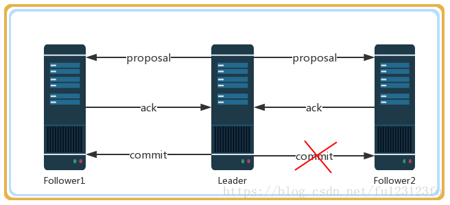

     leader对事务消息发起commit操作，该消息在follower1上执行了，但是follower2还没有收到commit，leader就已经挂了，而实际上客户端已经收到该事务消息处理成功的回执了。所以在zab协议下需要保证所有机器都要执行这个事务消息，必须满足已经被处理的消息不能丢失。

  2. **被丢弃的消息不能再次出现**

     当leader接收到消息请求生成proposal后就挂了，其他follower并没有收到此proposal，因此经过恢复模式重新选了leader后，这条消息是被跳过的。 此时，之前挂了的leader重新启动并注册成了follower，他保留了被跳过消息的proposal状态，与整个系统的状态是不一致的，需要将其删除。（leader都换代了，所以以前leader的proposal失效了）

- 针对以上两种情况分析

  - ZAB协议需要满足上面两种情况，就必须要设计一个leader选举算法，能够确保已经被leader提交的事务Proposal能够提交、同时丢弃已经被跳过的事务Proposal。针对这个要求：

  - 如果leader选举算法能够保证新选举出来的Leader服务器拥有集群中所有机器最高编号（ZXID 最大）的事务Proposal，那么就可以保证这个新选举出来的leader一定具有已经提交的提案。因为所有提案被commit之前必须有超过半数的follower ack，即必须有超过半数节点的服务器的事务日志上有该提案的proposal，因此只要有合法数量的节点正常工作，就必然有一个节点保存了所有被commit消息的proposal状态。

  - 另外一个，zxid是64位，高32位是epoch编号，每经过一次Leader选举产生一个新的leader，新的leader会将epoch号+1，低32位是消息计数器，每接收到一条消息这个值+1，新leader选举后这个值重置为0。这样设计的好处在于老的leader挂了以后重启，它不会被选举为leader，因此此时它的zxid肯定小于当前新的leader。当老的leader作为follower接入新的leader后，新的leader会让它将所有的拥有旧的epoch号的未被commit的proposal清除。

- ZXID

  - 也就是事务id，为了保证事务的顺序一致性，zookeeper采用了递增的事务id号（zxid）来标识事务。所有的提议（proposal）都在被提出的时候加上了zxid，实际中zxid是一个64位的数字，它高32位是epoch（ZAB协议通过epoch编号来区分Leader周期变化的策略）用来标识leader关系是否改变，每次一个leader被选出来，它都会有一个新的epoch=（原来的epoch+1），标识当前属于那个leader的统治时期。低32位用于递增计数。

    > epoch：可以理解为当前集群所处的年代或者周期，每个leader就像皇帝，都有自己的年号，所以每次改朝换代，leader变更之后，都会在前一个年代的基础上加1。这样就算旧的leader崩溃恢复之后，也没有人听他的了，因为follower只听从当前年代的leader的命令。

#### 测试epoch的变化

- 要测试epoch的变化可以做一个简单的实验：

  1. 启动一个zookeeper集群。

  2. 在`/tmp/zookeeper/VERSION-2`路径下会看到一个`currentEpoch`文件，文件中显示的是当前的epoch。

     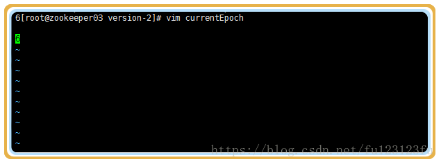

  3. 把leader节点停机，这个时候在看currentEpoch会发生变化。 随着每次选举新的leader，epoch都会发生变化。

     1. 先找到leader节点

        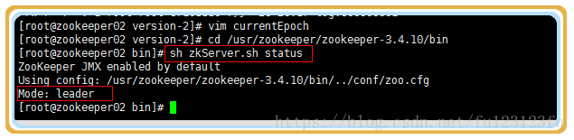

     2. 停止leader节点的服务

        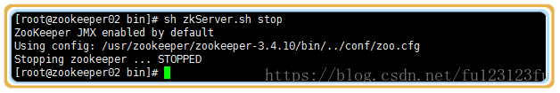

     3. 查看当前epoch号的变化（epoch号由原来的6变为7）

        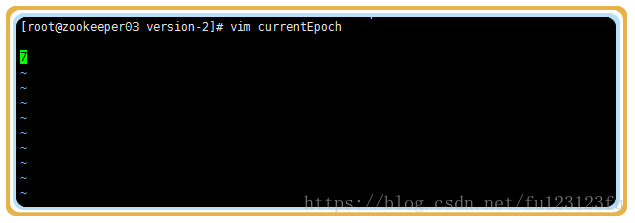